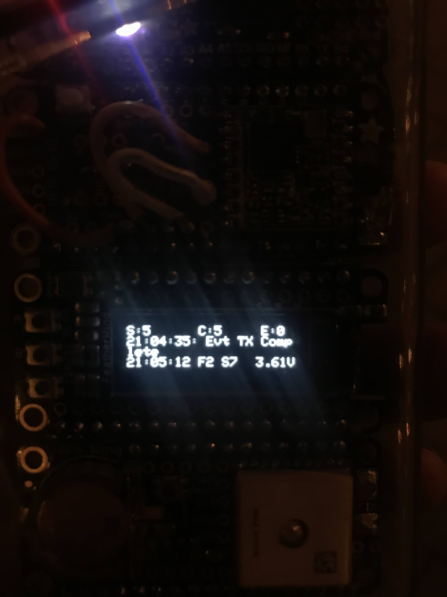

I did some great work and finished my LoRa The Things Network Mapper. Just a few days before the conference. The arduino sketch what I used is: [ttn-mapper](https://github.com/incyi/ttn-mapper)  

The following components are used:  

Part | Link
 --- | ---
Adafruit Feather M4 Express | [adafruit](https://www.adafruit.com/product/3857)
Adafruit LoRa radio Featherwing | [adafruit](http://www.adafruit.com/products/3231)
Adafruit OLED Featherwing | [adafruit](https://www.adafruit.com/product/2900)
Adafruit Ultimate GPS Featherwing | [adafruit](https://www.adafruit.com/product/3133)
Molex 211140-0100 868MHz flexible antenna | [farnell](https://nl.farnell.com/molex/211140-0100/868-915mhz-flexible-antenna100mm/dp/3225220)
WITZ Keep it Clear Waterproof Sports Case | [amazon](https://www.amazon.com/WITZ-Clear-Waterproof-Sports-Purple/dp/B01M0AWAYE)

  

  

  

  

  

  

  

  
