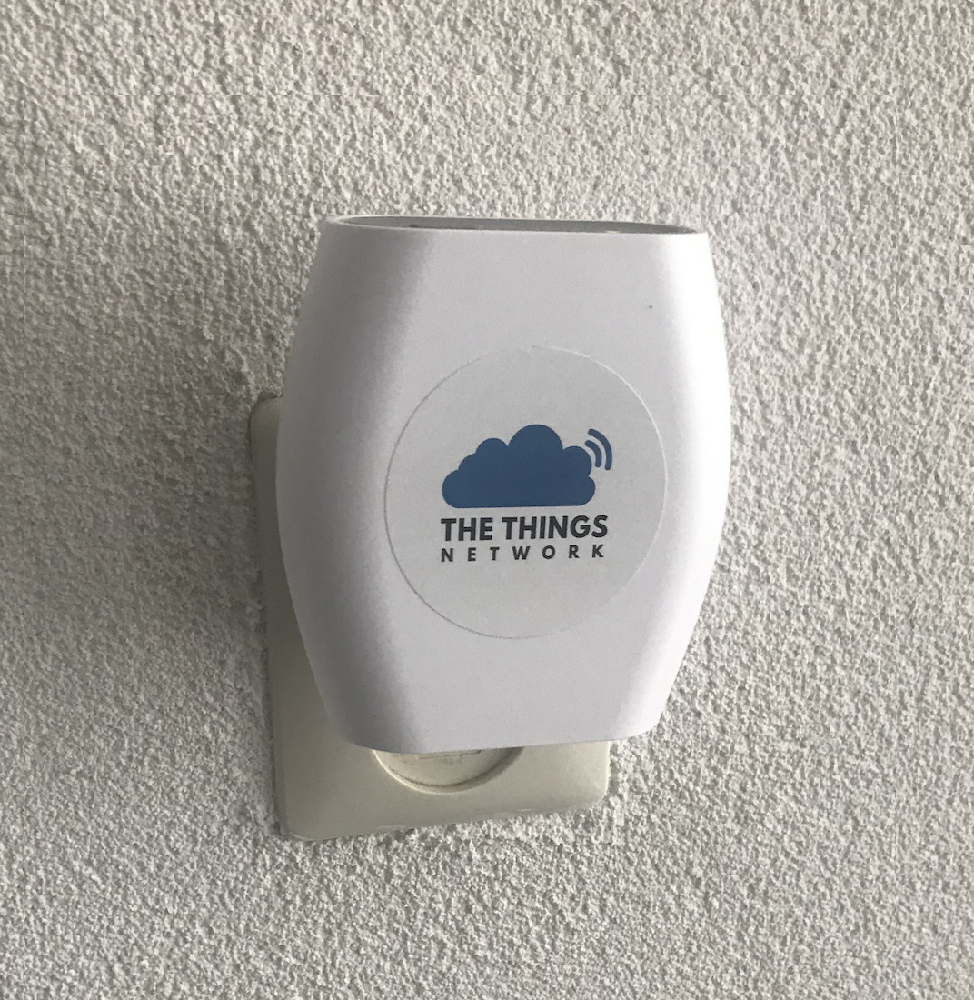

# Embedded Inventory
(This needs an update...)
- Previous screen: Flysight Black Pearl RC801 [Amazon](https://www.amazon.de/dp/B06X3W8PZ2/ref=cm_sw_r_tw_dp_U_x_G6MgDb0VK7436)
- My previous Raspberry Pi screen: Chimei Innolux N070ICG-LD4 Rev C1 + Touch screen module [Ebay](https://www.ebay.com/itm/HDMI-LCD-Driver-Board-Module-IPS-7-1280-800-IPS-N070ICG-LD1-LCD-Panel-Matrix/142458649828?hash=item212b327ce4:g:J0UAAOSwrzpZeqd~:rk:10:pf:0)

### Gateways
(This needs an update...)
- TTIG Gateway

### Nodes
(This needs an update...)
- [Node 1](https://www.thethingsnetwork.org/labs/story/build-the-cheapest-possible-node-yourself) Cheap Arduino Pro Mini node
- [Node 2](https://www.thethingsnetwork.org/labs/story/creating-a-ttn-node) Workshop Arduino Pro Mini node
- [Node 3](https://www.github.com/YourproductSmarter/KISSLoRa-demo) Kiss Lora from E&A expo 2017
- [Node 4](https://www.thethingsnetwork.org/labs/story/a-cheap-stm32-arduino-node) STM32 Node
- [Node 5](https://www.st.com/en/evaluation-tools/b-l072z-lrwan1.html) STMicroelectronics B-L072Z-LRWAN1
- [Node 6](https://www.thethingsnetwork.org/docs/devices/node/) The Things Node

### TTN Mapper
(This needs an update...)
- [TTN Mapper with Feather M4](https://incyi.github.io/2020/01/28/ttn-mapper-finished.html)
- [TTN Mapper with RAK811](https://github.com/incyi/RAK811_BreakBoard) [map](https://ttnmapper.org/devices/?device=rak-811-60c5a8fffe000010&startdate=&enddate=&gateways=on&lines=on&points=on)
[RAK811](https://nl.aliexpress.com/item/RAK811-LoRa-Tracker-Board-MAX-7Q-GPS-Module-en-MEMS-Sensor-draadloze-Afstandsbediening-Positionering-Oplossing-LoRaWAN/32844470946.html?spm=a2g0s.9042311.0.0.6e664c4dvFtHqP)

## Espressif
(This needs an update...)
- [Heltec ESP32 LoRa x2](https://nl.aliexpress.com/item/2-STKS-868-MHz-915-MHz-SX1276-ESP32-LoRa-0-96-Inch-Blauw-Oled-display-Bluetooth/32836576437.html?spm=a2g0s.9042311.0.0.6e664c4dvFtHqP)
- [Wemos D1 Mini V3.0.0](https://nl.aliexpress.com/item/D1-mini-Mini-NodeMcu-4M-bytes-Lua-WIFI-Internet-of-Things-development-board-based-ESP8266/32529101036.html) x3
- [Wemos D1 mini Pro V1.1.0](https://nl.aliexpress.com/item/WEMOS-D1-mini-Pro-16M-bytes-external-antenna-connector-ESP8266-WIFI-Internet-of-Things-development-board/32724692514.html) This is used in my single channel gateway
- ESP modules ESP-01
- ESP modules ESP-03
- ESP modules ESP-07

## Other platforms
(This needs an update...)
- Atmel STK500
- PocketBeagle
- NXP LPCXpresso
- Microchip
- Texas Instruments
- [Blue Pill](https://nl.aliexpress.com/item/STM32F103C8T6-ARM-STM32-Minimum-Development-Board-Module-for-arduino/32809970602.html)
- Raspberry Pi 3
- 2x Raspberry Pi Zero W
